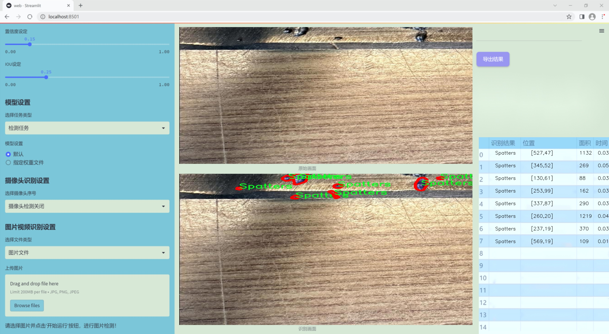
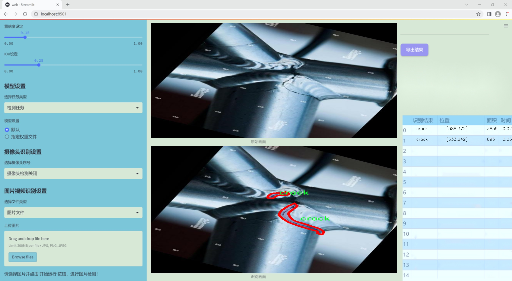
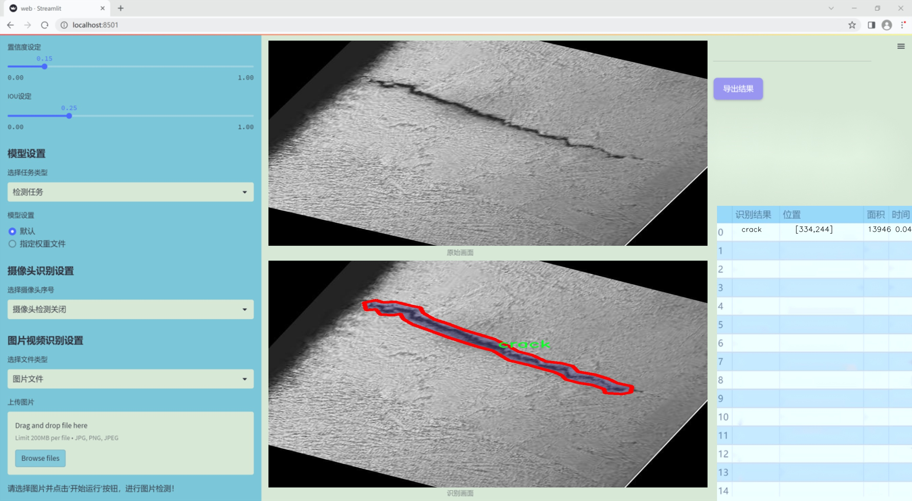
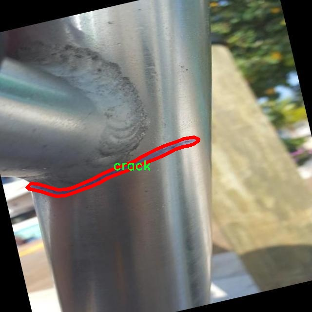
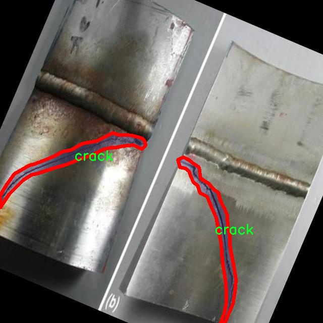
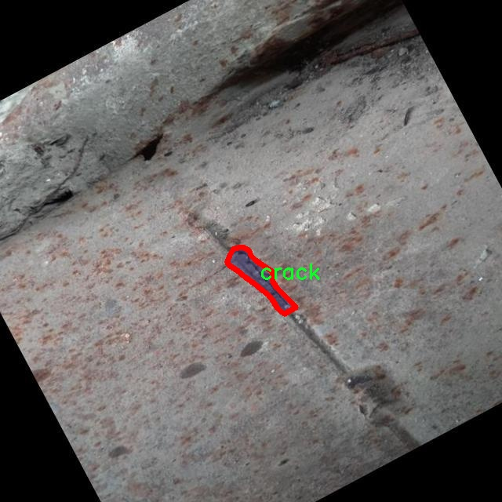
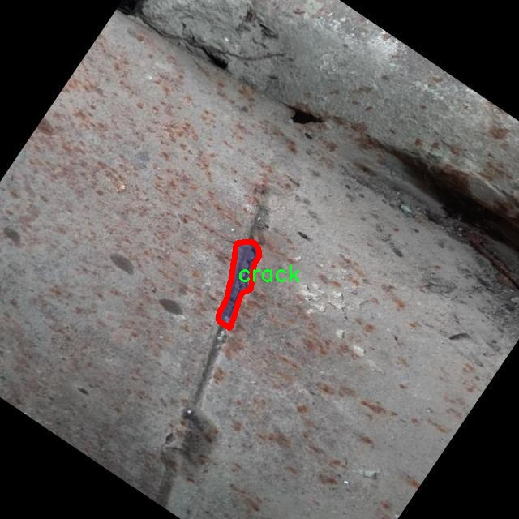
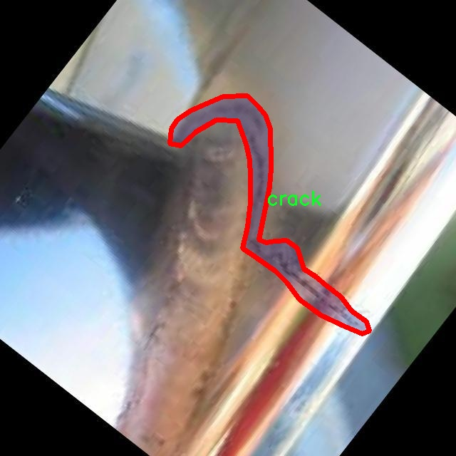

### 1.背景意义

研究背景与意义

焊接作为一种广泛应用于制造业的连接技术，其质量直接影响到产品的安全性和可靠性。然而，焊接过程中常常会出现各种缺陷，如飞溅、裂纹和孔隙等，这些缺陷不仅降低了焊接接头的强度，还可能导致严重的安全隐患。因此，开发一种高效、准确的焊接缺陷检测系统，对于提升焊接质量、保障产品安全具有重要的现实意义。

近年来，随着计算机视觉和深度学习技术的迅猛发展，基于图像处理的焊接缺陷检测方法逐渐成为研究热点。特别是YOLO（You Only Look Once）系列模型，以其高效的实时检测能力和较高的准确率，成为了焊接缺陷检测领域的重要工具。YOLOv11作为该系列的最新版本，具备更强的特征提取能力和更快的推理速度，为焊接缺陷的自动检测提供了新的可能性。

本研究基于改进的YOLOv11模型，旨在构建一个焊接缺陷检测系统。我们将使用包含1800张图像的数据集，数据集中涵盖了三种主要的焊接缺陷类型：飞溅、裂纹和孔隙。这些缺陷的准确识别和分类，对于后续的焊接工艺改进和质量控制具有重要的指导意义。通过对焊接缺陷的自动检测，能够显著提高检测效率，降低人工成本，同时也为焊接行业的智能化发展提供了有力支持。

此外，随着工业4.0的推进，智能制造已成为未来的发展趋势。基于深度学习的焊接缺陷检测系统，不仅能够实现实时监控和反馈，还能通过数据分析和学习，不断优化焊接工艺和质量控制流程。因此，本研究的开展，将为焊接行业的智能化转型提供重要的技术支撑，推动焊接技术的持续进步与创新。

### 2.视频效果

[2.1 视频效果](https://www.bilibili.com/video/BV1uaCFYPE9s/)

### 3.图片效果







##### [项目涉及的源码数据来源链接](https://kdocs.cn/l/cszuIiCKVNis)**

注意：本项目提供训练的数据集和训练教程,由于版本持续更新,暂不提供权重文件（best.pt）,请按照6.训练教程进行训练后实现上图演示的效果。

### 4.数据集信息

##### 4.1 本项目数据集类别数＆类别名

nc: 3
names: ['Spatters', 'crack', 'porosity']


该项目为【图像分割】数据集，请在【训练教程和Web端加载模型教程（第三步）】这一步的时候按照【图像分割】部分的教程来训练

##### 4.2 本项目数据集信息介绍

本项目数据集信息介绍

本项目所使用的数据集专注于焊接缺陷的检测，旨在为改进YOLOv11模型提供高质量的训练样本。数据集的主题为“weld_defects”，涵盖了焊接过程中可能出现的三种主要缺陷类型：飞溅（Spatters）、裂纹（crack）和孔洞（porosity）。这些缺陷不仅影响焊接接头的强度和耐久性，还可能导致结构性故障，因此准确识别和分类这些缺陷对于焊接质量控制至关重要。

数据集中包含丰富的图像样本，每种缺陷类型均有大量标注图像，确保模型在训练过程中能够学习到不同缺陷的特征和表现形式。飞溅缺陷通常表现为焊接过程中产生的小金属颗粒，这些颗粒可能附着在焊缝表面，影响焊接的美观和性能；裂纹则是焊接过程中最常见且最具破坏性的缺陷，通常由应力集中或焊接热影响区的不均匀冷却引起；而孔洞缺陷则是由于气体未能排出而在焊缝中形成的空洞，可能导致焊接接头的强度下降。

通过对这些缺陷的详细标注和分类，数据集为YOLOv11模型的训练提供了坚实的基础。模型将通过学习这些缺陷的特征，提升其在实际应用中的检测能力和准确性。数据集的设计不仅考虑了多样性和代表性，还确保了样本的高质量和标注的准确性，从而为焊接缺陷检测系统的优化奠定了良好的基础。最终目标是实现一个高效、准确的焊接缺陷自动检测系统，提升焊接工艺的整体质量和安全性。











### 5.全套项目环境部署视频教程（零基础手把手教学）

[5.1 所需软件PyCharm和Anaconda安装教程（第一步）](https://www.bilibili.com/video/BV1BoC1YCEKi/?spm_id_from=333.999.0.0&vd_source=bc9aec86d164b67a7004b996143742dc)


[5.2 安装Python虚拟环境创建和依赖库安装视频教程（第二步）](https://www.bilibili.com/video/BV1ZoC1YCEBw?spm_id_from=333.788.videopod.sections&vd_source=bc9aec86d164b67a7004b996143742dc)

### 6.改进YOLOv11训练教程和Web_UI前端加载模型教程（零基础手把手教学）

[6.1 改进YOLOv11训练教程和Web_UI前端加载模型教程（第三步）](https://www.bilibili.com/video/BV1BoC1YCEhR?spm_id_from=333.788.videopod.sections&vd_source=bc9aec86d164b67a7004b996143742dc)


按照上面的训练视频教程链接加载项目提供的数据集，运行train.py即可开始训练



     Epoch   gpu_mem       box       obj       cls    labels  img_size
     1/200     20.8G   0.01576   0.01955  0.007536        22      1280: 100%|██████████| 849/849 [14:42<00:00,  1.04s/it]
               Class     Images     Labels          P          R     mAP@.5 mAP@.5:.95: 100%|██████████| 213/213 [01:14<00:00,  2.87it/s]
                 all       3395      17314      0.994      0.957      0.0957      0.0843

     Epoch   gpu_mem       box       obj       cls    labels  img_size
     2/200     20.8G   0.01578   0.01923  0.007006        22      1280: 100%|██████████| 849/849 [14:44<00:00,  1.04s/it]
               Class     Images     Labels          P          R     mAP@.5 mAP@.5:.95: 100%|██████████| 213/213 [01:12<00:00,  2.95it/s]
                 all       3395      17314      0.996      0.956      0.0957      0.0845

     Epoch   gpu_mem       box       obj       cls    labels  img_size
     3/200     20.8G   0.01561    0.0191  0.006895        27      1280: 100%|██████████| 849/849 [10:56<00:00,  1.29it/s]
               Class     Images     Labels          P          R     mAP@.5 mAP@.5:.95: 100%|███████   | 187/213 [00:52<00:00,  4.04it/s]
                 all       3395      17314      0.996      0.957      0.0957      0.0845


###### [项目数据集下载链接](https://kdocs.cn/l/cszuIiCKVNis)

### 7.原始YOLOv11算法讲解


##### YOLO11介绍

Ultralytics YOLO11是一款尖端的、最先进的模型，它在之前YOLO版本成功的基础上进行了构建，并引入了新功能和改进，以进一步提升性能和灵活性。
**YOLO11设计快速、准确且易于使用，使其成为各种物体检测和跟踪、实例分割、图像分类以及姿态估计任务的绝佳选择。**


**结构图如下：**


##### **C3k2**

**C3k2，结构图如下**


**C3k2，继承自类`C2f，其中通过c3k设置False或者Ture来决定选择使用C3k还是`**Bottleneck


**实现代码** **ultralytics/nn/modules/block.py**

##### C2PSA介绍

**借鉴V10 PSA结构，实现了C2PSA和C2fPSA，最终选择了基于C2的C2PSA（可能涨点更好？）**


**实现代码** **ultralytics/nn/modules/block.py**

##### Detect介绍

**分类检测头引入了DWConv（更加轻量级，为后续二次创新提供了改进点），结构图如下（和V8的区别）：**


### 8.200+种全套改进YOLOV11创新点原理讲解

#### 8.1 200+种全套改进YOLOV11创新点原理讲解大全

由于篇幅限制，每个创新点的具体原理讲解就不全部展开，具体见下列网址中的改进模块对应项目的技术原理博客网址【Blog】（创新点均为模块化搭建，原理适配YOLOv5~YOLOv11等各种版本）

[改进模块技术原理博客【Blog】网址链接](https://gitee.com/qunmasj/good)


#### 8.2 精选部分改进YOLOV11创新点原理讲解

###### 这里节选部分改进创新点展开原理讲解(完整的改进原理见上图和[改进模块技术原理博客链接](https://gitee.com/qunmasj/good)【如果此小节的图加载失败可以通过CSDN或者Github搜索该博客的标题访问原始博客，原始博客图片显示正常】

### Gold-YOLO


#### Preliminaries
YOLO系列的中间层结构采用了传统的FPN结构，其中包含多个分支用于多尺度特征融合。然而，它只充分融合来自相邻级别的特征，对于其他层次的信息只能间接地进行“递归”获取。

传统的FPN结构在信息传输过程中存在丢失大量信息的问题。这是因为层之间的信息交互仅限于中间层选择的信息，未被选择的信息在传输过程中被丢弃。这种情况导致某个Level的信息只能充分辅助相邻层，而对其他全局层的帮助较弱。因此，整体上信息融合的有效性可能受到限制。
为了避免在传输过程中丢失信息，本文采用了一种新颖的“聚集和分发”机制（GD），放弃了原始的递归方法。该机制使用一个统一的模块来收集和融合所有Level的信息，并将其分发到不同的Level。通过这种方式，作者不仅避免了传统FPN结构固有的信息丢失问题，还增强了中间层的部分信息融合能力，而且并没有显著增加延迟。


#### 低阶聚合和分发分支 Low-stage gather-and-distribute branch
从主干网络中选择输出的B2、B3、B4、B5特征进行融合，以获取保留小目标信息的高分辨率特征。


#### 高阶聚合和分发分支 High-stage gather-and-distribute branch
高级全局特征对齐模块（High-GD）将由低级全局特征对齐模块（Low-GD）生成的特征{P3, P4, P5}进行融合。


Transformer融合模块由多个堆叠的transformer组成，transformer块的数量为L。每个transformer块包括一个多头注意力块、一个前馈网络（FFN）和残差连接。采用与LeViT相同的设置来配置多头注意力块，使用16个通道作为键K和查询Q的头维度，32个通道作为值V的头维度。为了加速推理过程，将层归一化操作替换为批归一化，并将所有的GELU激活函数替换为ReLU。为了增强变换器块的局部连接，在两个1x1卷积层之间添加了一个深度卷积层。同时，将FFN的扩展因子设置为2，以在速度和计算成本之间取得平衡。


信息注入模块(Information injection module)： 高级全局特征对齐模块（High-GD）中的信息注入模块与低级全局特征对齐模块（Low-GD）中的相同。在高级阶段，局部特征（Flocal）等于Pi，因此公式如下所示：


#### 增强的跨层信息流动 Enhanced cross-layer information flow
为了进一步提升性能，从YOLOv6 中的PAFPN模块中得到启发，引入了Inject-LAF模块。该模块是注入模块的增强版，包括了一个轻量级相邻层融合（LAF）模块，该模块被添加到注入模块的输入位置。为了在速度和准确性之间取得平衡，设计了两个LAF模型：LAF低级模型和LAF高级模型，分别用于低级注入（合并相邻两层的特征）和高级注入（合并相邻一层的特征）。它们的结构如图5(b)所示。为了确保来自不同层级的特征图与目标大小对齐，在实现中的两个LAF模型仅使用了三个操作符：双线性插值（上采样过小的特征）、平均池化（下采样过大的特征）和1x1卷积（调整与目标通道不同的特征）。模型中的LAF模块与信息注入模块的结合有效地平衡了准确性和速度之间的关系。通过使用简化的操作，能够增加不同层级之间的信息流路径数量，从而提高性能而不显著增加延迟。


### 9.系统功能展示

图9.1.系统支持检测结果表格显示

  图9.2.系统支持置信度和IOU阈值手动调节

  图9.3.系统支持自定义加载权重文件best.pt(需要你通过步骤5中训练获得)

  图9.4.系统支持摄像头实时识别

  图9.5.系统支持图片识别

  图9.6.系统支持视频识别

  图9.7.系统支持识别结果文件自动保存

  图9.8.系统支持Excel导出检测结果数据


### 10. YOLOv11核心改进源码讲解

#### 10.1 afpn.py

以下是对给定代码的核心部分进行分析和注释。主要保留了模型的结构和前向传播逻辑，同时添加了详细的中文注释。

```python
import torch
import torch.nn as nn
import torch.nn.functional as F
from ..modules.conv import Conv  # 导入卷积模块
from ..modules.block import C2f, C3, C3Ghost, C3k2  # 导入不同类型的模块

class BasicBlock(nn.Module):
    """基本块，包含两个卷积层和残差连接"""
    expansion = 1

    def __init__(self, filter_in, filter_out):
        super(BasicBlock, self).__init__()
        self.conv1 = Conv(filter_in, filter_out, 3)  # 第一个卷积层
        self.conv2 = Conv(filter_out, filter_out, 3, act=False)  # 第二个卷积层，不使用激活函数

    def forward(self, x):
        residual = x  # 保存输入以便后续的残差连接
        out = self.conv1(x)  # 通过第一个卷积层
        out = self.conv2(out)  # 通过第二个卷积层
        out += residual  # 添加残差
        return self.conv1.act(out)  # 返回激活后的输出

class Upsample(nn.Module):
    """上采样模块"""
    def __init__(self, in_channels, out_channels, scale_factor=2):
        super(Upsample, self).__init__()
        self.upsample = nn.Sequential(
            Conv(in_channels, out_channels, 1),  # 1x1卷积
            nn.Upsample(scale_factor=scale_factor, mode='bilinear')  # 双线性插值上采样
        )

    def forward(self, x):
        return self.upsample(x)  # 前向传播

class Downsample_x2(nn.Module):
    """2倍下采样模块"""
    def __init__(self, in_channels, out_channels):
        super(Downsample_x2, self).__init__()
        self.downsample = Conv(in_channels, out_channels, 2, 2, 0)  # 2x2卷积，步幅为2

    def forward(self, x):
        return self.downsample(x)  # 前向传播

class ASFF_2(nn.Module):
    """自适应特征融合模块（2个输入）"""
    def __init__(self, inter_dim=512):
        super(ASFF_2, self).__init__()
        self.inter_dim = inter_dim
        compress_c = 8  # 压缩通道数

        # 权重卷积层
        self.weight_level_1 = Conv(self.inter_dim, compress_c, 1)
        self.weight_level_2 = Conv(self.inter_dim, compress_c, 1)
        self.weight_levels = nn.Conv2d(compress_c * 2, 2, kernel_size=1)  # 最终权重计算
        self.conv = Conv(self.inter_dim, self.inter_dim, 3)  # 融合后的卷积层

    def forward(self, input1, input2):
        # 计算每个输入的权重
        level_1_weight_v = self.weight_level_1(input1)
        level_2_weight_v = self.weight_level_2(input2)

        # 合并权重并计算最终权重
        levels_weight_v = torch.cat((level_1_weight_v, level_2_weight_v), 1)
        levels_weight = self.weight_levels(levels_weight_v)
        levels_weight = F.softmax(levels_weight, dim=1)  # 使用softmax归一化权重

        # 融合特征
        fused_out_reduced = input1 * levels_weight[:, 0:1, :, :] + input2 * levels_weight[:, 1:2, :, :]
        out = self.conv(fused_out_reduced)  # 通过卷积层
        return out  # 返回融合后的输出

class BlockBody_P345(nn.Module):
    """主干网络，处理3个尺度的特征"""
    def __init__(self, channels=[64, 128, 256, 512]):
        super(BlockBody_P345, self).__init__()

        # 定义不同尺度的卷积块
        self.blocks_scalezero1 = nn.Sequential(Conv(channels[0], channels[0], 1))
        self.blocks_scaleone1 = nn.Sequential(Conv(channels[1], channels[1], 1))
        self.blocks_scaletwo1 = nn.Sequential(Conv(channels[2], channels[2], 1))

        # 下采样和上采样模块
        self.downsample_scalezero1_2 = Downsample_x2(channels[0], channels[1])
        self.upsample_scaleone1_2 = Upsample(channels[1], channels[0], scale_factor=2)

        # 自适应特征融合模块
        self.asff_scalezero1 = ASFF_2(inter_dim=channels[0])
        self.asff_scaleone1 = ASFF_2(inter_dim=channels[1])

        # 定义卷积块
        self.blocks_scalezero2 = nn.Sequential(*[BasicBlock(channels[0], channels[0]) for _ in range(4)])
        self.blocks_scaleone2 = nn.Sequential(*[BasicBlock(channels[1], channels[1]) for _ in range(4)])

    def forward(self, x):
        x0, x1, x2 = x  # 输入的3个尺度特征

        # 通过卷积块处理特征
        x0 = self.blocks_scalezero1(x0)
        x1 = self.blocks_scaleone1(x1)
        x2 = self.blocks_scaletwo1(x2)

        # 进行特征融合
        scalezero = self.asff_scalezero1(x0, self.upsample_scaleone1_2(x1))
        scaleone = self.asff_scaleone1(self.downsample_scalezero1_2(x0), x1)

        # 处理融合后的特征
        x0 = self.blocks_scalezero2(scalezero)
        x1 = self.blocks_scaleone2(scaleone)

        return x0, x1, x2  # 返回处理后的特征

class AFPN_P345(nn.Module):
    """自适应特征金字塔网络（AFPN）"""
    def __init__(self, in_channels=[256, 512, 1024], out_channels=256, factor=4):
        super(AFPN_P345, self).__init__()

        # 定义输入特征的卷积层
        self.conv0 = Conv(in_channels[0], in_channels[0] // factor, 1)
        self.conv1 = Conv(in_channels[1], in_channels[1] // factor, 1)
        self.conv2 = Conv(in_channels[2], in_channels[2] // factor, 1)

        # 定义主干网络
        self.body = BlockBody_P345([in_channels[0] // factor, in_channels[1] // factor, in_channels[2] // factor])

        # 定义输出特征的卷积层
        self.conv00 = Conv(in_channels[0] // factor, out_channels, 1)
        self.conv11 = Conv(in_channels[1] // factor, out_channels, 1)
        self.conv22 = Conv(in_channels[2] // factor, out_channels, 1)

    def forward(self, x):
        x0, x1, x2 = x  # 输入的3个尺度特征

        # 通过卷积层处理特征
        x0 = self.conv0(x0)
        x1 = self.conv1(x1)
        x2 = self.conv2(x2)

        # 通过主干网络处理特征
        out0, out1, out2 = self.body([x0, x1, x2])

        # 通过输出卷积层处理特征
        out0 = self.conv00(out0)
        out1 = self.conv11(out1)
        out2 = self.conv22(out2)
        return [out0, out1, out2]  # 返回处理后的特征
```

### 主要内容总结：
1. **BasicBlock**：实现了基本的卷积块，包含两个卷积层和残差连接。
2. **Upsample 和 Downsample**：实现了上采样和下采样模块，分别用于特征图的尺寸调整。
3. **ASFF**：自适应特征融合模块，通过计算输入特征的权重进行融合。
4. **BlockBody_P345**：主干网络，处理三个尺度的特征，并进行融合。
5. **AFPN_P345**：自适应特征金字塔网络，整合输入特征并通过主干网络处理，输出处理后的特征。

这些模块构成了一个深度学习模型的基础，适用于图像处理任务，特别是在特征提取和融合方面。

该文件 `afpn.py` 定义了一系列用于图像处理的深度学习模块，主要用于构建特征金字塔网络（FPN）。这些模块通过多层卷积和上采样、下采样操作，来提取和融合不同尺度的特征，以增强模型对目标的检测和识别能力。

首先，文件导入了一些必要的库，包括 `torch` 和 `torch.nn`，并从其他模块中引入了自定义的卷积层和块。文件的开头定义了一个 `BasicBlock` 类，这是一个基本的卷积块，包含两个卷积层和残差连接。这个结构有助于在深层网络中缓解梯度消失的问题。

接下来，定义了一些上采样和下采样的模块，包括 `Upsample`、`Downsample_x2`、`Downsample_x4` 和 `Downsample_x8`。这些模块用于调整特征图的尺寸，以便在不同尺度之间进行特征融合。

然后，文件中定义了几个自适应特征融合模块（ASFF），如 `ASFF_2`、`ASFF_3` 和 `ASFF_4`。这些模块通过计算不同输入特征图的权重，来融合来自不同尺度的特征图。它们使用了卷积层来生成权重，并通过 softmax 函数进行归一化，以确保权重的总和为1。

`BlockBody_P345` 和 `BlockBody_P2345` 类分别定义了特征提取的主体结构，包含多个卷积块和自适应特征融合模块。它们通过多次下采样和上采样操作，逐步处理不同尺度的特征图，增强特征的表达能力。

`AFPN_P345` 和 `AFPN_P2345` 类则是完整的特征金字塔网络实现，负责将输入的特征图进行处理并输出融合后的特征图。这些类中也包含了权重初始化的代码，以确保网络的训练稳定性。

最后，`BlockBody_P345_Custom` 和 `BlockBody_P2345_Custom` 类允许用户自定义块的类型，使得网络结构更加灵活，能够适应不同的应用需求。

整体来看，该文件实现了一个灵活且强大的特征金字塔网络结构，适用于各种计算机视觉任务，尤其是在目标检测和分割等领域。通过合理的模块组合和特征融合，模型能够有效地利用多尺度信息，从而提升性能。

#### 10.2 transformer.py

以下是经过简化和注释的核心代码部分：

```python
import torch
import torch.nn as nn
from functools import partial

# 导入自定义的归一化模块
from .prepbn import RepBN, LinearNorm
from ..modules.transformer import TransformerEncoderLayer

# 定义归一化的部分
ln = nn.LayerNorm
linearnorm = partial(LinearNorm, norm1=ln, norm2=RepBN, step=60000)

class TransformerEncoderLayer_RepBN(TransformerEncoderLayer):
    def __init__(self, c1, cm=2048, num_heads=8, dropout=0, act=..., normalize_before=False):
        # 初始化父类的构造函数
        super().__init__(c1, cm, num_heads, dropout, act, normalize_before)
        
        # 使用自定义的归一化方法
        self.norm1 = linearnorm(c1)
        self.norm2 = linearnorm(c1)

class AIFI_RepBN(TransformerEncoderLayer_RepBN):
    """定义AIFI变换器层。"""

    def __init__(self, c1, cm=2048, num_heads=8, dropout=0, act=nn.GELU(), normalize_before=False):
        """使用指定参数初始化AIFI实例。"""
        super().__init__(c1, cm, num_heads, dropout, act, normalize_before)

    def forward(self, x):
        """AIFI变换器层的前向传播。"""
        c, h, w = x.shape[1:]  # 获取输入的通道数、高度和宽度
        pos_embed = self.build_2d_sincos_position_embedding(w, h, c)  # 构建位置嵌入
        # 将输入从形状[B, C, H, W]展平为[B, HxW, C]
        x = super().forward(x.flatten(2).permute(0, 2, 1), pos=pos_embed.to(device=x.device, dtype=x.dtype))
        # 将输出形状转换回[B, C, H, W]
        return x.permute(0, 2, 1).view([-1, c, h, w]).contiguous()

    @staticmethod
    def build_2d_sincos_position_embedding(w, h, embed_dim=256, temperature=10000.0):
        """构建2D正弦-余弦位置嵌入。"""
        assert embed_dim % 4 == 0, "嵌入维度必须是4的倍数"
        grid_w = torch.arange(w, dtype=torch.float32)  # 水平方向的网格
        grid_h = torch.arange(h, dtype=torch.float32)  # 垂直方向的网格
        grid_w, grid_h = torch.meshgrid(grid_w, grid_h, indexing="ij")  # 创建网格
        pos_dim = embed_dim // 4  # 计算位置维度
        omega = torch.arange(pos_dim, dtype=torch.float32) / pos_dim
        omega = 1.0 / (temperature**omega)  # 计算频率

        # 计算位置嵌入
        out_w = grid_w.flatten()[..., None] @ omega[None]
        out_h = grid_h.flatten()[..., None] @ omega[None]

        # 返回拼接的正弦和余弦值
        return torch.cat([torch.sin(out_w), torch.cos(out_w), torch.sin(out_h), torch.cos(out_h)], 1)[None]
```

### 代码注释说明：
1. **导入模块**：导入必要的PyTorch模块和自定义的归一化模块。
2. **归一化定义**：使用`partial`创建一个自定义的归一化函数`linearnorm`，结合了标准层归一化和自定义的RepBN。
3. **TransformerEncoderLayer_RepBN类**：继承自`TransformerEncoderLayer`，并在初始化时定义了两个归一化层。
4. **AIFI_RepBN类**：继承自`TransformerEncoderLayer_RepBN`，定义了AIFI变换器层的前向传播逻辑。
5. **前向传播**：在`forward`方法中，输入张量被展平并进行位置嵌入的计算，最后输出形状恢复为原始的[B, C, H, W]格式。
6. **位置嵌入构建**：`build_2d_sincos_position_embedding`方法用于生成2D正弦-余弦位置嵌入，确保嵌入维度为4的倍数，并根据给定的宽度和高度生成相应的嵌入。

这个程序文件定义了一个用于Transformer模型的自定义层，主要包括两个类：`TransformerEncoderLayer_RepBN`和`AIFI_RepBN`。首先，文件导入了必要的PyTorch库和模块，使用了`functools.partial`来简化函数调用。`linearnorm`是一个部分应用的函数，用于创建具有特定规范化的线性层。

`TransformerEncoderLayer_RepBN`类继承自`TransformerEncoderLayer`，在初始化时调用父类的构造函数，并定义了两个归一化层`norm1`和`norm2`，它们使用了之前定义的`linearnorm`函数。这使得该层在处理输入时能够进行更复杂的归一化操作。

接下来，`AIFI_RepBN`类继承自`TransformerEncoderLayer_RepBN`，并在其构造函数中进一步初始化。该类的主要功能是实现一个特定的Transformer层，名为AIFI。构造函数中允许用户指定多个参数，如输入通道数、隐藏层大小、注意力头数、丢弃率、激活函数和是否在前向传播前进行归一化。

在`forward`方法中，输入张量`x`的形状被调整，以便与位置嵌入相结合。首先，提取输入的通道数、高度和宽度，然后调用`build_2d_sincos_position_embedding`方法生成二维正弦余弦位置嵌入。接着，输入张量被展平并转置，以适应Transformer的输入格式。最终，经过父类的前向传播后，输出张量的形状被恢复为原始的四维形状。

`build_2d_sincos_position_embedding`是一个静态方法，用于生成二维位置嵌入。它首先检查嵌入维度是否可以被4整除，然后生成宽度和高度的网格，并计算出对应的正弦和余弦值。最终，返回的嵌入张量包含了这两个维度的位置信息，并通过`torch.cat`将它们连接在一起。

总体而言，这个文件实现了一个自定义的Transformer层，结合了位置嵌入和特定的归一化方法，适用于处理图像等二维数据。

#### 10.3 lsknet.py

以下是保留的核心代码部分，并添加了详细的中文注释：

```python
import torch
import torch.nn as nn
from functools import partial

class Mlp(nn.Module):
    """ 多层感知机（MLP）模块 """
    def __init__(self, in_features, hidden_features=None, out_features=None, act_layer=nn.GELU, drop=0.):
        super().__init__()
        out_features = out_features or in_features  # 输出特征数
        hidden_features = hidden_features or in_features  # 隐藏层特征数
        self.fc1 = nn.Conv2d(in_features, hidden_features, 1)  # 第一层卷积
        self.dwconv = DWConv(hidden_features)  # 深度卷积
        self.act = act_layer()  # 激活函数
        self.fc2 = nn.Conv2d(hidden_features, out_features, 1)  # 第二层卷积
        self.drop = nn.Dropout(drop)  # Dropout层

    def forward(self, x):
        """ 前向传播 """
        x = self.fc1(x)  # 第一层卷积
        x = self.dwconv(x)  # 深度卷积
        x = self.act(x)  # 激活
        x = self.drop(x)  # Dropout
        x = self.fc2(x)  # 第二层卷积
        x = self.drop(x)  # Dropout
        return x

class Attention(nn.Module):
    """ 注意力模块 """
    def __init__(self, d_model):
        super().__init__()
        self.proj_1 = nn.Conv2d(d_model, d_model, 1)  # 线性投影
        self.activation = nn.GELU()  # 激活函数
        self.spatial_gating_unit = LSKblock(d_model)  # 空间门控单元
        self.proj_2 = nn.Conv2d(d_model, d_model, 1)  # 线性投影

    def forward(self, x):
        """ 前向传播 """
        shortcut = x.clone()  # 残差连接
        x = self.proj_1(x)  # 线性投影
        x = self.activation(x)  # 激活
        x = self.spatial_gating_unit(x)  # 空间门控
        x = self.proj_2(x)  # 线性投影
        x = x + shortcut  # 残差连接
        return x

class Block(nn.Module):
    """ 网络中的基本块，包含注意力和MLP """
    def __init__(self, dim, mlp_ratio=4., drop=0., drop_path=0., act_layer=nn.GELU):
        super().__init__()
        self.norm1 = nn.BatchNorm2d(dim)  # 第一个归一化层
        self.norm2 = nn.BatchNorm2d(dim)  # 第二个归一化层
        self.attn = Attention(dim)  # 注意力模块
        self.mlp = Mlp(in_features=dim, hidden_features=int(dim * mlp_ratio), act_layer=act_layer, drop=drop)  # MLP模块

    def forward(self, x):
        """ 前向传播 """
        x = x + self.attn(self.norm1(x))  # 添加注意力模块的输出
        x = x + self.mlp(self.norm2(x))  # 添加MLP模块的输出
        return x

class LSKNet(nn.Module):
    """ LSKNet网络结构 """
    def __init__(self, img_size=224, in_chans=3, embed_dims=[64, 128, 256, 512], depths=[3, 4, 6, 3]):
        super().__init__()
        self.num_stages = len(depths)  # 网络阶段数
        for i in range(self.num_stages):
            # 创建每个阶段的嵌入层和块
            patch_embed = OverlapPatchEmbed(img_size=img_size // (2 ** i), in_chans=in_chans if i == 0 else embed_dims[i - 1], embed_dim=embed_dims[i])
            block = nn.ModuleList([Block(dim=embed_dims[i]) for _ in range(depths[i])])
            setattr(self, f"patch_embed{i + 1}", patch_embed)
            setattr(self, f"block{i + 1}", block)

    def forward(self, x):
        """ 前向传播 """
        outs = []
        for i in range(self.num_stages):
            patch_embed = getattr(self, f"patch_embed{i + 1}")
            block = getattr(self, f"block{i + 1}")
            x, _, _ = patch_embed(x)  # 嵌入层
            for blk in block:
                x = blk(x)  # 块的前向传播
            outs.append(x)  # 保存每个阶段的输出
        return outs

class DWConv(nn.Module):
    """ 深度卷积模块 """
    def __init__(self, dim=768):
        super(DWConv, self).__init__()
        self.dwconv = nn.Conv2d(dim, dim, 3, padding=1, groups=dim)  # 深度卷积

    def forward(self, x):
        """ 前向传播 """
        return self.dwconv(x)  # 返回卷积结果

def lsknet_t(weights=''):
    """ 创建LSKNet T版本 """
    model = LSKNet(embed_dims=[32, 64, 160, 256], depths=[3, 3, 5, 2])
    if weights:
        model.load_state_dict(torch.load(weights)['state_dict'])  # 加载权重
    return model

if __name__ == '__main__':
    model = lsknet_t('lsk_t_backbone-2ef8a593.pth')  # 实例化模型
    inputs = torch.randn((1, 3, 640, 640))  # 随机输入
    for i in model(inputs):
        print(i.size())  # 打印输出尺寸
```

### 代码核心部分说明：
1. **Mlp**：实现了一个多层感知机，包括卷积层、深度卷积、激活函数和Dropout。
2. **Attention**：实现了一个注意力机制，包含线性投影和空间门控单元。
3. **Block**：构建了一个基本的网络块，包含注意力和MLP模块，并使用残差连接。
4. **LSKNet**：定义了整个网络结构，包含多个阶段，每个阶段由嵌入层和多个块组成。
5. **DWConv**：实现了深度卷积，用于特征提取。
6. **lsknet_t**：用于创建LSKNet的T版本，并可选择加载预训练权重。

这些部分共同构成了一个深度学习模型的基础架构，适用于图像处理任务。

这个程序文件 `lsknet.py` 实现了一个名为 LSKNet 的深度学习模型，主要用于图像处理任务。代码中使用了 PyTorch 框架，并包含了多个模块和类，构成了整个网络的结构。

首先，程序导入了必要的库，包括 PyTorch 的核心库和一些辅助模块。接着，定义了几个重要的类。`Mlp` 类实现了一个多层感知机，包含两个卷积层和一个深度卷积层，使用 GELU 激活函数和 Dropout 层来增强模型的非线性和防止过拟合。

`LSKblock` 类是一个关键的构建块，使用了多种卷积操作，包括深度卷积和空间卷积，来提取特征并进行注意力机制的计算。它通过对输入特征进行不同的卷积操作，生成两个注意力特征，然后通过平均和最大池化进行融合，最后通过 Sigmoid 激活函数生成注意力权重，对输入进行加权。

`Attention` 类则将 `LSKblock` 结合到一个更大的注意力机制中。它首先通过一个卷积层对输入进行线性变换，然后经过激活函数和空间门控单元，最后再通过另一个卷积层输出结果，并与输入进行残差连接。

`Block` 类是 LSKNet 的基本单元，包含了归一化层、注意力层和多层感知机。它通过残差连接和 DropPath 技术增强了模型的表达能力。

`OverlapPatchEmbed` 类负责将输入图像转换为补丁嵌入，使用卷积层来提取特征并进行归一化处理。

`LSKNet` 类是整个网络的主结构，它根据指定的参数构建多个阶段的网络，每个阶段包含补丁嵌入、多个块和归一化层。通过逐层处理输入，最终生成多个输出特征图。

`DWConv` 类实现了深度卷积操作，用于在 `Mlp` 类中。

`update_weight` 函数用于更新模型的权重，确保模型字典和权重字典中的键值匹配。

最后，提供了两个函数 `lsknet_t` 和 `lsknet_s`，用于创建不同配置的 LSKNet 模型，并可选择加载预训练权重。

在 `__main__` 部分，示例代码展示了如何实例化一个 LSKNet 模型，并对随机生成的输入进行前向传播，输出各层的特征图尺寸。这为用户提供了一个简单的测试框架，验证模型的构建和功能。

#### 10.4 head.py

以下是经过简化和注释的核心代码部分，主要集中在 `Detect_DyHead` 类及其相关方法上：

```python
import torch
import torch.nn as nn
import math

class Detect_DyHead(nn.Module):
    """YOLOv8 检测头，使用动态头（DyHead）进行目标检测。"""
    
    def __init__(self, nc=80, hidc=256, block_num=2, ch=()):
        """
        初始化检测头的参数。
        
        参数:
        nc (int): 类别数量。
        hidc (int): 隐藏层通道数。
        block_num (int): 动态头块的数量。
        ch (tuple): 输入通道数的元组。
        """
        super().__init__()
        self.nc = nc  # 类别数量
        self.nl = len(ch)  # 检测层数量
        self.reg_max = 16  # DFL 通道数
        self.no = nc + self.reg_max * 4  # 每个锚点的输出数量
        self.stride = torch.zeros(self.nl)  # 在构建过程中计算的步幅
        c2, c3 = max((16, ch[0] // 4, self.reg_max * 4)), max(ch[0], self.nc)  # 通道数
        
        # 定义卷积层
        self.conv = nn.ModuleList(nn.Sequential(Conv(x, hidc, 1)) for x in ch)
        self.dyhead = nn.Sequential(*[DyHeadBlock(hidc) for _ in range(block_num)])  # 动态头块
        self.cv2 = nn.ModuleList(
            nn.Sequential(Conv(hidc, c2, 3), Conv(c2, c2, 3), nn.Conv2d(c2, 4 * self.reg_max, 1)) for _ in ch
        )
        self.cv3 = nn.ModuleList(
            nn.Sequential(
                nn.Sequential(DWConv(hidc, x, 3), Conv(x, c3, 1)),
                nn.Sequential(DWConv(c3, c3, 3), Conv(c3, c3, 1)),
                nn.Conv2d(c3, self.nc, 1),
            )
            for x in ch
        )
        self.dfl = DFL(self.reg_max) if self.reg_max > 1 else nn.Identity()  # DFL 层

    def forward(self, x):
        """前向传播，返回预测的边界框和类别概率。"""
        for i in range(self.nl):
            x[i] = self.conv[i](x[i])  # 应用卷积层
        x = self.dyhead(x)  # 应用动态头
        
        shape = x[0].shape  # 获取输出形状
        for i in range(self.nl):
            # 将 cv2 和 cv3 的输出拼接
            x[i] = torch.cat((self.cv2[i](x[i]), self.cv3[i](x[i])), 1)
        
        if self.training:
            return x  # 如果在训练模式，返回中间结果
        
        # 动态调整锚点和步幅
        if self.shape != shape:
            self.anchors, self.strides = (x.transpose(0, 1) for x in make_anchors(x, self.stride, 0.5))
            self.shape = shape

        # 将输出展平并分割为边界框和类别
        x_cat = torch.cat([xi.view(shape[0], self.no, -1) for xi in x], 2)
        box, cls = x_cat.split((self.reg_max * 4, self.nc), 1)  # 分割边界框和类别
        
        # 解码边界框
        dbox = dist2bbox(self.dfl(box), self.anchors.unsqueeze(0), xywh=True, dim=1) * self.strides
        y = torch.cat((dbox, cls.sigmoid()), 1)  # 拼接边界框和类别概率
        return y  # 返回最终输出

    def bias_init(self):
        """初始化检测头的偏置，警告：需要步幅可用。"""
        for a, b, s in zip(self.cv2, self.cv3, self.stride):
            a[-1].bias.data[:] = 1.0  # 边界框偏置
            b[-1].bias.data[:self.nc] = math.log(5 / self.nc / (640 / s) ** 2)  # 类别偏置
```

### 代码说明
1. **Detect_DyHead 类**: 这是 YOLOv8 的检测头，负责处理输入特征并生成边界框和类别概率。
2. **构造函数 `__init__`**: 初始化类的参数，包括类别数量、隐藏层通道数、动态头块数量等。定义了多个卷积层和动态头块。
3. **前向传播 `forward`**: 处理输入数据，应用卷积层和动态头块，拼接输出，并最终返回边界框和类别概率。
4. **偏置初始化 `bias_init`**: 初始化卷积层的偏置，以提高模型的性能。

该代码是 YOLOv8 检测模型的核心部分，负责特征提取和目标检测的输出。

这个程序文件 `head.py` 是一个用于 YOLOv8（You Only Look Once v8）目标检测模型的实现，主要定义了多个检测头（Detect Head）类，这些类负责处理输入特征图并输出检测结果。以下是对代码的详细说明：

首先，文件引入了一些必要的库，包括 `torch` 和 `torch.nn`，这些库提供了构建神经网络所需的基本功能。此外，还引入了一些自定义模块，如 `Conv`、`DWConv`、`DFL` 等，这些模块在目标检测中扮演着重要角色。

文件中定义了多个检测头类，主要包括 `Detect_DyHead`、`Detect_AFPN_P345`、`Detect_Efficient` 等。这些类的构造函数通常接收参数，如类别数量 `nc`、隐藏通道数 `hidc`、特征图通道数 `ch` 等。每个类的初始化过程中，都会构建相应的卷积层和其他必要的层。

在 `Detect_DyHead` 类中，构造函数中创建了卷积层、动态头（`DyHeadBlock`）和输出层。`forward` 方法实现了前向传播，接收输入特征图 `x`，经过卷积和动态头处理后，生成边界框和类别概率。若模型处于训练状态，直接返回特征图；若处于推理状态，则计算锚框和步幅，并返回最终的检测结果。

`Detect_AFPN_P345` 类实现了具有自适应特征金字塔网络（AFPN）的检测头，适用于多层次特征融合。它的 `forward` 方法与 `Detect_DyHead` 类似，但在特征处理上采用了 AFPN 结构。

`Detect_Efficient` 类则实现了高效的检测头，主要通过简化的卷积操作来提高模型的推理速度。其 `forward` 方法同样负责特征图的处理和输出。

其他检测头类如 `Detect_LSCD`、`Detect_LADH`、`Detect_TADDH` 等，分别实现了不同的检测策略和结构，适应不同的任务需求，比如轻量级检测、旋转边界框检测等。

每个检测头类通常还包含 `bias_init` 方法，用于初始化模型的偏置参数，以提高模型的收敛速度和性能。

最后，文件中定义了一些辅助类和函数，如 `Scale`、`Conv_GN` 等，这些类和函数用于实现特定的功能，如可学习的缩放因子和标准卷积操作。

总的来说，这个文件是 YOLOv8 模型的核心部分，负责实现不同类型的检测头，以支持多种目标检测任务。通过组合不同的检测头，YOLOv8 能够在各种场景下实现高效的目标检测。

### 11.完整训练+Web前端界面+200+种全套创新点源码、数据集获取


# [下载链接：https://mbd.pub/o/bread/Z52Tl5lx](https://mbd.pub/o/bread/Z52Tl5lx)